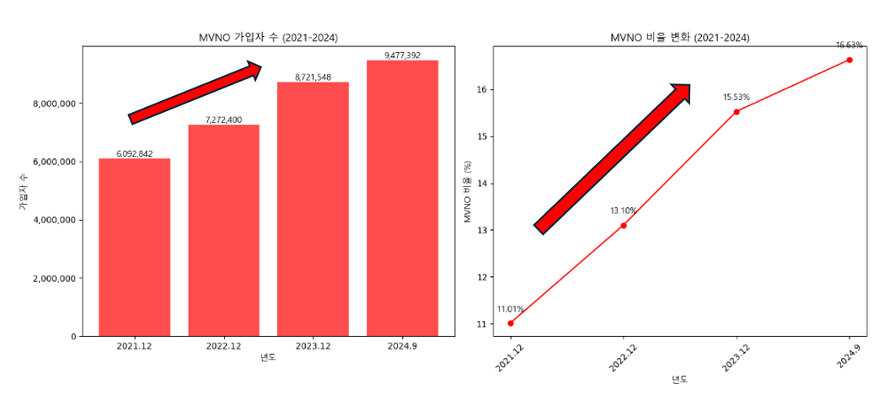

# README

  

Hi! I'm your first Markdown file in **StackEdit**. If you want to learn about StackEdit, you can read me. If you want to play with Markdown, you can edit me. Once you have finished with me, you can create new files by opening the **file explorer** on the left corner of the navigation bar.

  
  

# 주제

  

통신 3사(SKT, LGU+, KT) 중 하나의 기업의 인턴십 과정 중 최종 프로젝트가 남았다는 가정하에

**알뜰폰 회사들의 요금제 분석을 통한 인사이트 도출**을 주제로 과제를 진행하였습니다.

  

## 주제의 배경

위 그래프를 통해 **nvmo(알뜰폰) 회사들의 무선 통신 이용자 증가량이 급격하게 늘어나고 있음**을 알 수 있습니다. 2021년 609만명 이었던 가입자 수는 2022년 727만명, 2023년 872만명 2024년 9월을 기준으로는 947만명이 되며 매년 약19.4%, 19.9%, 8.6%라는 높은 증가율을 보고 있음을 알 수 있습니다.

또한 전체 통신사 시장에서도 2021년 이후 알뜰폰 통신사의 점유율이 매년 2%포인트 이상 증가하고 있기 때문에 이러한 알뜰폰 **통신사의 요금제들을 분석하고 인사이트를 도출을 통해 이용자 유지 및 확보를 위한 차기 전략 수립**하는 것이 중요하다고 생각하여 해당  주제를 선정하게 되었습니다.  
## 데이터 준비(수집)

  

주요 알뜰폰 회사의 최신(당일) 요금제를 크롤링하여 주요 특성들을 수집하였습니다. 현재 크롤링한 알뜰폰 회사들은 다음과 같습니다.

  

- 티플러스

- 토스 모바일

- 헬로모바일

- 아이즈모바일

  

## 데이터 소개

  

./data 폴더 내

  

- 아이즈모바일_data.csv

- 토스모바일_data.csv

- 티플러스_data.csv

- 헬로모바일_data.csv

- 알뜰폰_data.csv 가 존재하며 streamlit의 화면에는 **알뜰폰_data.csv**를 기반으로 데이터를 보여줍니다.

  

## Streamlit(main.py)의 구현
- 
  

